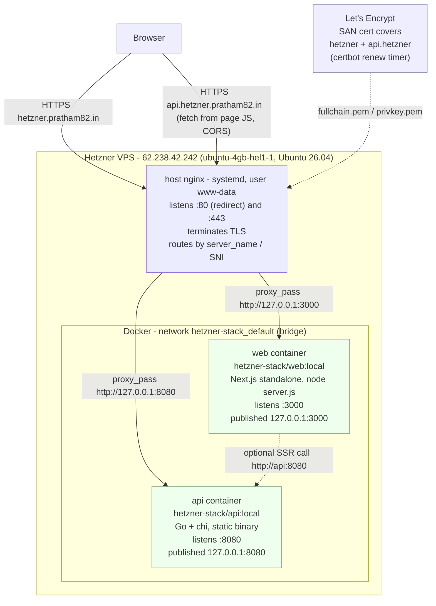
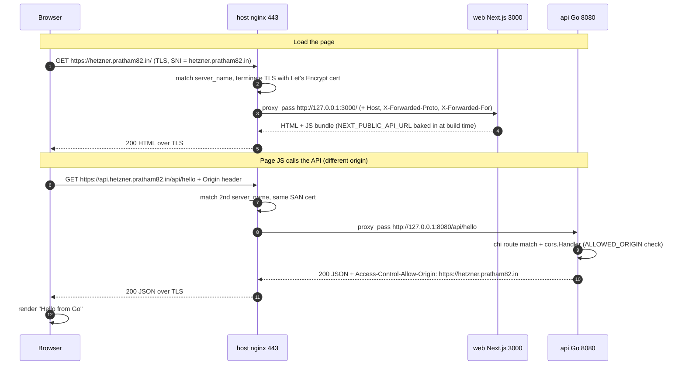

# hetzner-stack — Architecture

How the Next.js frontend and Go backend run in Docker and are served to the
internet through the host's nginx.

## System design



Only ports 22 / 80 / 443 on the host are reachable from the internet. Both
containers publish **only to `127.0.0.1`**, so nothing can bypass nginx and hit
them directly. nginx is the single front door and the only place TLS is handled.

## Request lifecycle



## Components

### host nginx (not containerized)

Runs from `/etc/nginx/nginx.conf` (a working copy is kept in the repo at
`deploy/nginx.conf` — keep them in sync). It already owned :80/:443 with a
certbot-managed cert, so it stays on the host rather than in a container to avoid
a port conflict and to reuse the existing TLS setup.

Two `server` blocks on :443, matched by `server_name`:

| Host | `proxy_pass` target | Backend |
| --- | --- | --- |
| `hetzner.pratham82.in` | `http://127.0.0.1:3000` | `web` container |
| `api.hetzner.pratham82.in` | `http://127.0.0.1:8080` | `api` container |

Matching `:80` blocks `return 301` to HTTPS. Shared `proxy_set_header` directives
(`Host`, `X-Real-IP`, `X-Forwarded-For`, `X-Forwarded-Proto`) are set once at the
`http {}` level and inherited.

### web container

Multi-stage build (`frontend/Dockerfile`):

1. `deps` — `npm ci`
2. `builder` — `next build` with `output: "standalone"`; `NEXT_PUBLIC_API_URL`
   passed as a build `ARG` because `NEXT_PUBLIC_*` values are **inlined into the
   JS bundle at build time**, not read at runtime.
3. `runner` — Node + `.next/standalone` + `.next/static` + `public` only; runs as
   non-root user `nextjs`; `node server.js` on `HOSTNAME=0.0.0.0 PORT=3000`.

Result: ~150 MB image instead of ~1 GB.

### api container

Multi-stage build (`backend/Dockerfile`):

1. `golang:1.24-alpine` — compiles a static binary (`CGO_ENABLED=0`,
   `-trimpath -ldflags="-s -w"`).
2. `alpine:3.20` — the binary + `ca-certificates` + `wget` (only for the compose
   healthcheck); runs as non-root user `app`.

The Go service uses `go-chi/chi` with `RequestID`, `RealIP`, `Logger`,
`Recoverer`, `Timeout(15s)`, and `go-chi/cors`. Routes:

| Method | Path | Response |
| --- | --- | --- |
| GET | `/healthz` | `{"status":"ok"}` |
| GET | `/api/hello` | `{"message":"Hello from Go","time":"<RFC3339>"}` |

Anything else returns Go's default `404 page not found`. Config via env:
`PORT` (default `8080`), `ALLOWED_ORIGIN` (default `https://hetzner.pratham82.in`;
`http://localhost:3000` is always allowed too). Graceful shutdown on
`SIGINT`/`SIGTERM` with a 10 s drain.

### Docker Compose

`docker-compose.yml` builds both images, puts them on the auto-created
`hetzner-stack_default` bridge network (so `web` can reach `api` at
`http://api:8080` for any server-side rendering), publishes each port to
`127.0.0.1` only, sets `restart: unless-stopped`, and gives `api` a healthcheck
hitting `/healthz`.

## CORS

The page origin (`https://hetzner.pratham82.in`) and the API origin
(`https://api.hetzner.pratham82.in`) differ, so the browser enforces CORS on the
`fetch`. The Go `cors.Handler` echoes back
`Access-Control-Allow-Origin: https://hetzner.pratham82.in`, which makes the
request succeed. Switching to a same-origin `/api/*` path proxy would remove the
need for CORS entirely.

## TLS

One certificate, lineage name `hetzner.pratham82.in`, SAN =
`{hetzner.pratham82.in, api.hetzner.pratham82.in}`, ECDSA key. Both `server`
blocks read the same `fullchain.pem` / `privkey.pem` under
`/etc/letsencrypt/live/hetzner.pratham82.in/`. certbot installed a systemd timer
that renews in the background; one renewal covers both names.

## Reboot behaviour

`docker.service` is `enabled` and both containers use `restart: unless-stopped`,
so after a reboot Docker starts and relaunches `web` and `api` automatically.
host nginx is a normal enabled systemd service and comes back on its own.

## Deploy / redeploy

```bash
cd ~/projects/hetzner-stack && git pull
docker compose up -d --build
docker image prune -f
```

nginx changes are made on the host in `/etc/nginx/nginx.conf` (mirror them into
`deploy/nginx.conf`), then `sudo nginx -t && sudo systemctl reload nginx`.

## Rollback

```bash
docker compose down
sudo cp /etc/nginx/nginx.conf.bak.<date> /etc/nginx/nginx.conf
sudo nginx -t && sudo systemctl reload nginx
```
